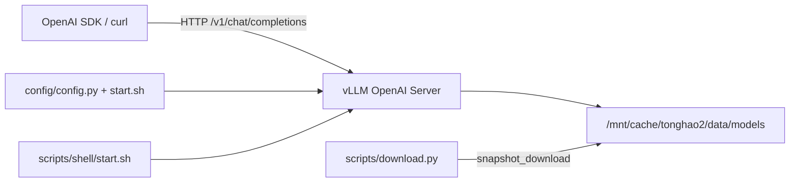

# vllm-model-server

基于 [vLLM](https://github.com/vllm-project/vllm) 的裸机 OpenAI 兼容模型推理服务。模型权重存放在 `/mnt/cache/tonghao2/data/models`，通过配置和启动脚本即可拉起服务。

## 环境要求

- Linux + NVIDIA GPU（推荐 A800 80GB）
- CUDA 12.x + 对应 NVIDIA Driver
- [Conda](https://docs.conda.io/)（推荐，用于 Python 环境管理）
- 已下载的 Hugging Face 格式模型（含 `config.json` 与权重）

## Conda 环境配置

本仓库支持两套环境，**互不覆盖**：

| 环境 | 脚本 | 用途 |
|------|------|------|
| `vllm-model-server` | `scripts/shell/install.sh` | Qwen2.5 / Qwen3-Coder，锁定 vLLM 0.8.5 + torch cu124 |
| `vllm-qwen35` | `scripts/shell/install-qwen35.sh` | **Qwen3.5-122B**（`qwen3_5_moe`），vLLM nightly |

### 旧栈（Qwen2.5 / 0.8.5）

新容器内 PyPI 往往不可直连，**请使用安装脚本**（已配置国内镜像，失败会自动切换阿里云）：

```bash
cd /mnt/cache/tonghao2/slns/vllm-model-server

# 全新安装（推荐，删旧环境避免依赖冲突）
bash scripts/shell/install.sh --recreate

# 环境已存在、仅补装依赖
bash scripts/shell/install.sh

# 可选：自定义镜像
cp scripts/shell/mirrors.env.example scripts/shell/mirrors.env
# 编辑 mirrors.env 后重新执行 install.sh

conda activate vllm-model-server
```

安装脚本会：

1. 配置 pip 镜像（默认清华源，`mirrors.env` 可改）
2. 创建 conda 环境（python 3.10）
3. 锁定安装 **torch 2.6.0+cu124 + vllm 0.8.5**（适配驱动 535 / CUDA 12.4）
4. 验证 GPU 可访问

手动安装请与 `install.sh` 保持相同版本锁定，勿 `pip install vllm` 拉最新版（会与 CUDA 12.4 驱动冲突）。

验证安装：

```bash
conda activate vllm-model-server
python -c "import vllm; print(vllm.__version__)"
vllm --help
```

### Qwen3.5 环境（nightly）

`Qwen3.5-122B-A10B` 需要能识别 `qwen3_5_moe` 的 vLLM / transformers，**请使用独立环境**（按 [Qwen 模型卡](https://huggingface.co/Qwen/Qwen3.5-122B-A10B) 安装 nightly）：

```bash
cd /mnt/cache/tonghao2/slns/vllm-model-server

# 需要能访问 PyPI 镜像 + https://wheels.vllm.ai/nightly（可先 source 代理）
bash scripts/shell/install-qwen35.sh --recreate

conda activate vllm-qwen35
python -c "import vllm, transformers; print(vllm.__version__, transformers.__version__)"
bash scripts/shell/start.sh
```

说明：

- 默认环境名 `vllm-qwen35`（可用 `CONDA_ENV_NAME=...` 覆盖）
- **不会**删除或修改 `vllm-model-server`
- nightly 无固定版本号，装完建议 `pip show vllm transformers torch` 留档
- `start.sh` 中 `VLLM_USE_V1=0` 已注释；仅旧 0.8.x 环境需要时自行 `export VLLM_USE_V1=0`

> vLLM 依赖 CUDA，请确保 `nvidia-smi` 正常。容器内若 Hugging Face 下载慢，可设 `export HF_ENDPOINT=https://hf-mirror.com`（`install.sh` 会在 `mirrors.env` 中提示）。

## 快速开始

```bash
# 1. 激活 conda 环境（Qwen3.5 用 vllm-qwen35；旧模型用 vllm-model-server）
conda activate vllm-qwen35

# 2. 编辑 scripts/shell/start.sh 顶部配置（模型、端口等，见 config/config.py）

# 3. 启动服务
bash scripts/shell/start.sh

# 4. 健康检查（另开终端；PORT 与 start.sh 一致）
PORT=8000 ./scripts/health_check.sh

# 5. 调用示例
python examples/chat_client.py
```

服务启动后：

- 健康检查：`GET http://127.0.0.1:8000/health`
- 模型列表：`GET http://127.0.0.1:8000/v1/models`
- OpenAPI 文档：`http://127.0.0.1:8000/docs`
- Chat API：`POST http://127.0.0.1:8000/v1/chat/completions`

## 目录结构

```text
vllm-model-server/
├── README.md
├── environment.yml          # Conda 环境定义
├── pyproject.toml           # 可选：uv 依赖定义
├── config/
│   └── config.py            # 模型注册表（根路径 + 子路径 + 服务名）
├── scripts/
│   ├── shell/
│   │   ├── install.sh           # Conda + pip：vllm 0.8.5（Qwen2.5）
│   │   ├── install-qwen35.sh    # Conda + pip：vLLM nightly（Qwen3.5）
│   │   ├── start.sh             # 启动 vLLM 服务（配置在脚本顶部）
│   │   ├── download.sh          # 模型下载（改脚本内列表即可）
│   │   └── mirrors.env.example  # 镜像配置模板
│   ├── download.py          # Hugging Face 下载脚本
│   └── health_check.sh      # 健康检查
└── examples/
    └── chat_client.py       # OpenAI SDK 调用示例
```

## 配置说明

编辑 `scripts/shell/start.sh` 顶部配置，常用变量：

| 变量 | 说明 | 默认值 |
|------|------|--------|
| `MODELS_ROOT` | 本地模型权重根目录 | `/mnt/cache/tonghao2/data/models` |
| `MODEL_KEY` | 从 `config/config.py` 选择预设模型 | `qwen2.5-coder-32b` |
| `PORT` | 监听端口 | `8000` |
| `TENSOR_PARALLEL_SIZE` | GPU 卡数（tensor parallel） | `1` |
| `SERVED_MODEL_NAME` | 对外暴露的模型名（由 `MODEL_KEY` 解析） | 随 `MODEL_KEY` |
| `MAX_MODEL_LEN` | 最大上下文长度 | 见 `config/config.py` |
| `GPU_MEM_UTIL` | GPU 显存利用率 | 见 `config/config.py` |
| `API_KEY` | 可选鉴权密钥，留空则关闭 | 空 |
| `HF_HOME` | Hugging Face 缓存目录 | `/mnt/cache/tonghao2/data/cache` |

切换模型示例（改 `start.sh`）：

```bash
export MODEL_KEY=qwen3-coder-30b-a3b
```

## 下载模型

编辑 [`scripts/shell/download.sh`](/mnt/cache/tonghao2/slns/vllm-model-server/scripts/shell/download.sh)，在「下载列表」里取消注释要下的模型，然后执行：

```bash
conda activate vllm-model-server
bash scripts/shell/download.sh
```

脚本示例（直接改文件）：

```bash
download_model "Qwen/Qwen3.5-122B-A10B"
# download_model "Qwen/Qwen2.5-Coder-14B-Instruct"
```

临时下载单个模型（不改脚本）：

```bash
bash scripts/shell/download.sh Qwen/Qwen2.5-Coder-14B-Instruct
```

默认下载到 `/mnt/cache/tonghao2/data/models/<repo_id>`，自动走 `HF_ENDPOINT=https://hf-mirror.com`。
gated 模型需设置 `HF_TOKEN`（可在 `scripts/shell/mirrors.env` 中配置）。

对于 gated 模型（如 Llama），在 `.env` 中设置 `HF_TOKEN` 或导出环境变量：

```bash
export HF_TOKEN=hf_xxx
```

## 已有本地模型

以下模型已在 `/mnt/cache/tonghao2/data/models` 下载完成，可直接用于 vLLM：

| 模型 | 本地路径 | 显存估算 | 特点 |
|------|----------|----------|------|
| Qwen2.5-Coder-3B-Instruct | `Qwen/Qwen2.5-Coder-3B-Instruct` | ~6GB | 轻量联调 |
| Qwen2.5-Coder-7B-Instruct | `Qwen/Qwen2.5-Coder-7B-Instruct` | ~16GB | 速度快 |
| Qwen2.5-Coder-14B-Instruct | `Qwen/Qwen2.5-Coder-14B-Instruct` | ~30GB | **默认推荐** |
| Qwen2.5-Coder-32B-Instruct | `Qwen/Qwen2.5-Coder-32B-Instruct` | ~65GB | 强 coding |
| Qwen3-Coder-30B-A3B-Instruct | `Qwen/Qwen3-Coder-30B-A3B-Instruct` | ~35GB active | MoE，质量好 |

不适合本服务的权重：

- `ByteDance/Bernini-Diffusers` — 扩散模型
- `Qwen3-Embedding-0.6B`、`sentence-transformers/all-MiniLM-L6-v2` — Embedding 模型

## 推荐开源模型（如需新下载）

| 模型 | HuggingFace ID | 许可 | A800 显存 | 适合场景 |
|------|----------------|------|-----------|----------|
| Qwen3.5 系列 | `Qwen/Qwen3.5-32B-Instruct` | Apache 2.0 | ~65GB | 通用、推理、多语言 |
| DeepSeek-V3/V4 | `deepseek-ai/DeepSeek-V3` | MIT | 多卡/量化 | 代码与推理 |
| Llama 4 Scout | `meta-llama/Llama-4-Scout-17B-16E-Instruct` | Meta 自定义 | ~35GB active | 超长上下文 |
| Llama 4 Maverick | `meta-llama/Llama-4-Maverick-17B-128E-Instruct` | Meta 自定义 | ~35GB active | 通用旗舰 MoE |
| GLM-4 | `THUDM/glm-4-9b-chat` | 视版本 | ~20GB | 中文 Agent |
| Phi-4 | `microsoft/phi-4` | MIT | ~30GB | 小模型强推理 |
| Gemma 3 27B | `google/gemma-3-27b-it` | Gemma | ~55GB | 本地部署性价比 |

### 按场景选择

- **代码 / SQL**：优先用已有 Qwen Coder；升级可选 `Qwen3.5-Coder` 或 `DeepSeek-V3`
- **通用对话 / RAG**：`Qwen3.5-32B-Instruct`
- **超长文档**：`Llama-4-Scout`
- **中文 Agent**：`GLM-4.6` 或 `Qwen3.5`
- **最低成本试跑**：`Qwen2.5-Coder-7B-Instruct`

## API 调用示例

### curl

```bash
curl http://127.0.0.1:8000/v1/chat/completions \
  -H "Content-Type: application/json" \
  -d '{
    "model": "qwen2.5-coder-14b",
    "messages": [
      {"role": "user", "content": "用 Python 写一个快速排序"}
    ]
  }'
```

### OpenAI Python SDK

```python
from openai import OpenAI

client = OpenAI(
    base_url="http://127.0.0.1:8000/v1",
    api_key="EMPTY",  # 若设置了 API_KEY，改为对应值
)

response = client.chat.completions.create(
    model="qwen2.5-coder-14b",
    messages=[{"role": "user", "content": "Hello"}],
)
print(response.choices[0].message.content)
```

也可直接运行：

```bash
python examples/chat_client.py \
  --model qwen2.5-coder-14b \
  --prompt "写一个二分查找"
```

## 切换模型

1. 修改 `scripts/shell/start.sh` 中的 `MODEL_KEY`，或在 `config/config.py` 中增删模型条目
2. 重新执行 `bash scripts/shell/start.sh`

示例：

```bash
export MODEL_KEY=qwen2.5-coder-32b
export MAX_MODEL_LEN=16384
export GPU_MEM_UTIL=0.92
```

## 常见问题

### Conda / pip 安装失败

新容器常见原因是 PyPI 不可达。不要直接用 `conda env create` 装 pip 依赖，改用：

```bash
bash scripts/shell/install.sh
```

若仍失败，检查镜像并编辑 `scripts/shell/mirrors.env`：

```bash
PIP_INDEX_URL=https://mirrors.aliyun.com/pypi/simple/
PIP_TRUSTED_HOST=mirrors.aliyun.com
```

若 conda-forge 也慢，可在 `mirrors.env` 中启用：

```bash
CONDA_FORGE_MIRROR=https://mirrors.tuna.tsinghua.edu.cn/anaconda/cloud/conda-forge/
```

### Conda 环境相关

```bash
# 更新环境（environment.yml 变更后）
conda env update -f environment.yml --prune

# 删除并重建（推荐）
bash scripts/shell/install.sh --recreate
```

每次新开终端启动服务前，需先执行 `conda activate vllm-model-server`。

### OOM（显存不足）

- 降低 `MAX_MODEL_LEN`（如 `16384` 或 `8192`）
- 降低 `GPU_MEM_UTIL`（如 `0.85`）
- 换更小模型（7B / 14B）

### gated 模型下载失败

设置 Hugging Face Token：

```bash
export HF_TOKEN=hf_xxx
# 或在 start.sh 中配置 HF_TOKEN
```

### 服务启动慢

大模型首次加载权重到 GPU 需要数分钟，属正常现象。可通过 `nvidia-smi` 观察显存占用确认加载进度。

### API 返回 401

若在 `start.sh` 设置了 `API_KEY`，请求需带：

```bash
-H "Authorization: Bearer <your-api-key>"
```

## 架构



vLLM 原生提供 OpenAI 兼容 API，无需额外 FastAPI 封装层。

## License

本项目代码可自由使用；各模型权重遵循其上游 Hugging Face 仓库许可。
